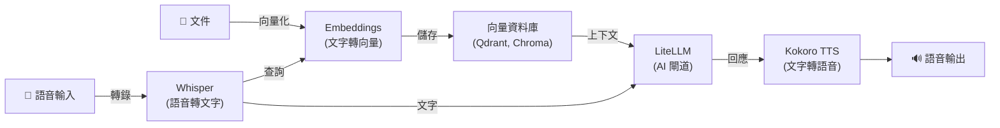

[English](README.md) | [简体中文](README-zh.md) | [繁體中文](README-zh-Hant.md) | [Русский](README-ru.md)

# Whisper 語音轉文字 Docker 映像檔

[](https://github.com/hwdsl2/docker-whisper/actions/workflows/main.yml) &nbsp;[](https://opensource.org/licenses/MIT)

使用 [faster-whisper](https://github.com/SYSTRAN/faster-whisper) 在 Docker 容器中執行 [Whisper](https://github.com/openai/whisper) 語音轉文字伺服器。提供 OpenAI 相容的音訊轉錄 API。基於 Debian (python:3.12-slim)，簡單、私密、可自架。

**功能特性：**

- OpenAI 相容的 `POST /v1/audio/transcriptions` 端點 — 任何呼叫 OpenAI Whisper API 的應用程式只需修改一行設定即可切換
- 支援所有 Whisper 模型：`tiny`、`base`、`small`、`medium`、`large-v3`、`large-v3-turbo` 等
- 透過輔助腳本 (`whisper_manage`) 管理模型
- 音訊資料保留在您的伺服器上，不傳送給第三方
- 支援所有主流音訊格式（mp3、m4a、wav、webm、ogg、flac 及 ffmpeg 支援的所有格式）
- 多種回應格式：JSON、純文字、詳細 JSON、SRT 字幕、WebVTT 字幕
- 串流轉錄 — 加入 `stream=true` 參數，即可透過 SSE 在解碼時逐段接收轉錄結果，無需等待整個檔案處理完成
- 離線/隔離網路模式 — 使用預先快取的模型無需網際網路存取 (`WHISPER_LOCAL_ONLY`)
- 透過 [GitHub Actions](https://github.com/hwdsl2/docker-whisper/actions/workflows/main.yml) 自動建置和發布
- 透過 Docker 資料卷持久化模型快取
- 多架構支援：`linux/amd64`、`linux/arm64`

**另提供：**

- AI/音訊：[Kokoro (TTS)](https://github.com/hwdsl2/docker-kokoro/blob/main/README-zh-Hant.md)、[Embeddings](https://github.com/hwdsl2/docker-embeddings/blob/main/README-zh-Hant.md)、[LiteLLM](https://github.com/hwdsl2/docker-litellm/blob/main/README-zh-Hant.md)
- VPN：[WireGuard](https://github.com/hwdsl2/docker-wireguard/blob/main/README-zh-Hant.md)、[OpenVPN](https://github.com/hwdsl2/docker-openvpn/blob/main/README-zh-Hant.md)、[IPsec VPN](https://github.com/hwdsl2/docker-ipsec-vpn-server/blob/master/README-zh-Hant.md)、[Headscale](https://github.com/hwdsl2/docker-headscale/blob/main/README-zh-Hant.md)

**提示：** Whisper、Kokoro、Embeddings 和 LiteLLM 可以[搭配使用](#與其他-ai-服務搭配使用)，在您自己的伺服器上建立完整的私密 AI 系統。

## 快速開始

使用以下指令啟動 Whisper 伺服器：

```bash
docker run \
    --name whisper \
    --restart=always \
    -v whisper-data:/var/lib/whisper \
    -p 9000:9000 \
    -d hwdsl2/whisper-server
```

**注：** 如需面向網際網路的部署，**強烈建議**使用[反向代理](#使用反向代理)來新增 HTTPS。此時，還應將上述 `docker run` 命令中的 `-p 9000:9000` 替換為 `-p 127.0.0.1:9000:9000`，以防止從外部直接存取未加密連接埠。

首次啟動時，Whisper `base` 模型（約 145 MB）將自動下載並快取。查看日誌確認伺服器已就緒：

```bash
docker logs whisper
```

看到 "Whisper speech-to-text server is ready" 後，開始轉錄您的第一個音訊檔案：

```bash
curl http://您的伺服器IP:9000/v1/audio/transcriptions \
    -F file=@audio.mp3 \
    -F model=whisper-1
```

**回應：**
```json
{"text": "轉錄的文字內容顯示在這裡。"}
```

## 系統需求

- 已安裝 Docker 的 Linux 伺服器（本地或雲端）
- 支援的架構：`amd64`（x86_64）、`arm64`（例如 Raspberry Pi 4/5、AWS Graviton）
- 最低記憶體：預設 `base` 模型約需 500 MB 可用記憶體（請參閱[模型清單](#切換模型)）
- 首次啟動需要存取網際網路以下載模型（之後模型將快取於本機）。使用預先快取的模型並設定 `WHISPER_LOCAL_ONLY=true` 時不需要網路存取。

如需面向公網部署，請參閱[使用反向代理](#使用反向代理)以啟用 HTTPS。

## 下載

從 [Docker Hub](https://hub.docker.com/r/hwdsl2/whisper-server/) 取得受信任的建置：

```bash
docker pull hwdsl2/whisper-server
```

也可從 [Quay.io](https://quay.io/repository/hwdsl2/whisper-server) 下載：

```bash
docker pull quay.io/hwdsl2/whisper-server
docker image tag quay.io/hwdsl2/whisper-server hwdsl2/whisper-server
```

支援平台：`linux/amd64` 和 `linux/arm64`。

## 環境變數

所有變數均為選用。如未設定，將自動使用安全的預設值。

此 Docker 映像檔使用以下變數，可在 `env` 檔案中宣告（參見[範例](whisper.env.example)）：

| 變數 | 說明 | 預設值 |
|---|---|---|
| `WHISPER_MODEL` | 使用的 Whisper 模型。請參閱[模型清單](#切換模型)。 | `base` |
| `WHISPER_LANGUAGE` | 預設轉錄語言。使用 BCP-47 語言代碼（如 `zh`、`en`、`ja`）或 `auto` 自動偵測。 | `auto` |
| `WHISPER_PORT` | API 的 HTTP 連接埠（1–65535）。 | `9000` |
| `WHISPER_DEVICE` | 推論使用的運算裝置。 | `cpu` |
| `WHISPER_COMPUTE_TYPE` | 量化 / 計算類型。建議使用 `int8`。 | `int8` |
| `WHISPER_THREADS` | 推論使用的 CPU 執行緒數。設為實體核心數可獲得最佳延遲。 | `2` |
| `WHISPER_API_KEY` | 選用的 Bearer 金鑰。設定後所有請求須包含 `Authorization: Bearer <key>`。 | *（未設定）* |
| `WHISPER_LOG_LEVEL` | 日誌等級：`DEBUG`、`INFO`、`WARNING`、`ERROR`、`CRITICAL`。 | `INFO` |
| `WHISPER_BEAM` | 轉錄解碼的 beam 大小。較大的值可能以速度換取精確度。使用 `1` 可獲得最快的貪婪解碼。 | `5` |
| `WHISPER_LOCAL_ONLY` | 設為任意非空值（如 `true`）時，停用所有 HuggingFace 模型下載。適用於預先快取模型的離線或隔離網路部署。 | *（未設定）* |

**注：** 在 `env` 檔案中，值可用單引號括起，例如 `VAR='value'`。`=` 兩側不要有空格。如更改 `WHISPER_PORT`，請相應更新 `docker run` 指令中的 `-p` 參數。

使用 `env` 檔案的範例：

```bash
cp whisper.env.example whisper.env
# 編輯 whisper.env 進行設定，然後：
docker run \
    --name whisper \
    --restart=always \
    -v whisper-data:/var/lib/whisper \
    -v ./whisper.env:/whisper.env:ro \
    -p 9000:9000 \
    -d hwdsl2/whisper-server
```

`env` 檔案以綁定掛載方式傳入容器，每次重啟時自動生效，無需重建容器。

或透過 `--env-file` 傳入：

```bash
docker run \
    --name whisper \
    --restart=always \
    -v whisper-data:/var/lib/whisper \
    -p 9000:9000 \
    --env-file=whisper.env \
    -d hwdsl2/whisper-server
```

## 使用 docker-compose

```bash
cp whisper.env.example whisper.env
# 依需求編輯 whisper.env，然後：
docker compose up -d
docker logs whisper
```

範例 `docker-compose.yml`（已包含在專案中）：

```yaml
services:
  whisper:
    image: hwdsl2/whisper-server
    container_name: whisper
    restart: always
    ports:
      - "9000:9000/tcp"  # 如使用主機反向代理，改為 "127.0.0.1:9000:9000/tcp"
    volumes:
      - whisper-data:/var/lib/whisper
      - ./whisper.env:/whisper.env:ro

volumes:
  whisper-data:
```

**注：** 如需面向公網部署，強烈建議使用[反向代理](#使用反向代理)啟用 HTTPS。此時請將 `docker-compose.yml` 中的 `"9000:9000/tcp"` 改為 `"127.0.0.1:9000:9000/tcp"`，以防止未加密連接埠被直接存取。

## API 參考

此 API 與 [OpenAI 音訊轉錄端點](https://developers.openai.com/api/reference/resources/audio/subresources/transcriptions/methods/create)完全相容。任何已呼叫 `https://api.openai.com/v1/audio/transcriptions` 的應用程式，只需設定以下環境變數即可切換至自架服務：

```
OPENAI_BASE_URL=http://您的伺服器IP:9000
```

### 轉錄音訊

```
POST /v1/audio/transcriptions
Content-Type: multipart/form-data
```

**參數：**

| 參數 | 類型 | 必填 | 說明 |
|---|---|---|---|
| `file` | 檔案 | ✅ | 音訊檔案。支援格式：`mp3`、`mp4`、`m4a`、`wav`、`webm`、`ogg`、`flac` 及 ffmpeg 支援的所有格式。 |
| `model` | 字串 | ✅ | 傳入 `whisper-1`（值被接受，但始終使用目前啟用的模型）。 |
| `language` | 字串 | — | BCP-47 語言代碼。覆寫本次請求的 `WHISPER_LANGUAGE` 設定。 |
| `prompt` | 字串 | — | 選用文字，用於引導模型風格或延續前一段內容。 |
| `response_format` | 字串 | — | 輸出格式，預設為 `json`。請參閱[回應格式](#回應格式)。`stream=true` 時忽略此參數。 |
| `temperature` | 浮點數 | — | 採樣溫度（0–1），預設為 `0`。 |
| `stream` | 布林值 | — | 啟用 SSE 串流。為 `true` 時，段落將在解碼時以 `text/event-stream` 事件形式回傳。預設為 `false`。 |

**範例：**

```bash
curl http://您的伺服器IP:9000/v1/audio/transcriptions \
    -F file=@meeting.m4a \
    -F model=whisper-1 \
    -F language=zh
```

使用 API 金鑰驗證：

```bash
curl http://您的伺服器IP:9000/v1/audio/transcriptions \
    -H "Authorization: Bearer your_api_key" \
    -F file=@audio.mp3 \
    -F model=whisper-1
```

### 回應格式

| `response_format` | 說明 |
|---|---|
| `json` | `{"text": "..."}` — 預設，與 OpenAI 基本回應格式一致 |
| `text` | 純文字，無 JSON 封裝 |
| `verbose_json` | 完整 JSON，包含語言、時長、逐段時間戳記及對數機率 |
| `srt` | SubRip 字幕格式（`.srt`） |
| `vtt` | WebVTT 字幕格式（`.vtt`） |

**範例 — 串流接收解碼段落：**

```bash
curl http://您的伺服器IP:9000/v1/audio/transcriptions \
    -F file=@long-audio.mp3 \
    -F model=whisper-1 \
    -F stream=true
```

**SSE 回應**（每個段落一個事件，最後一個為 `done` 事件）：

```
data: {"type":"segment","start":0.0,"end":2.4,"text":"您好，最近好嗎？"}

data: {"type":"segment","start":2.8,"end":5.1,"text":"我很好，謝謝。"}

data: {"type":"done","text":"您好，最近好嗎？ 我很好，謝謝。"}
```

上傳後第一個段落通常在 1–3 秒內到達。每個 `segment` 事件包含以秒為單位的 `start`/`end` 時間戳記。最後的 `done` 事件包含與標準 `json` 回應等效的完整轉錄文字。

**範例 — 透過瀏覽器 `fetch` 進行串流傳輸：**

```javascript
const form = new FormData();
form.append("file", audioBlob, "audio.webm");
form.append("model", "whisper-1");
form.append("stream", "true");

const res = await fetch("http://您的伺服器IP:9000/v1/audio/transcriptions", {
  method: "POST", body: form,
});

const reader = res.body.getReader();
const decoder = new TextDecoder();
let buffer = "";

while (true) {
  const { done, value } = await reader.read();
  if (done) break;
  buffer += decoder.decode(value, { stream: true });
  // SSE frames are separated by "\n\n"; split and process complete frames
  const frames = buffer.split("\n\n");
  buffer = frames.pop(); // keep any incomplete trailing frame
  for (const frame of frames) {
    if (!frame.startsWith("data: ")) continue;
    const event = JSON.parse(frame.slice(6));
    if (event.type === "segment") console.log(event.text);
    if (event.type === "done") console.log("Full text:", event.text);
  }
}
```

**範例 — 取得 SRT 字幕：**

```bash
curl http://您的伺服器IP:9000/v1/audio/transcriptions \
    -F file=@video.mp4 \
    -F model=whisper-1 \
    -F response_format=srt
```

**範例 — 含時間戳記的詳細 JSON：**

```bash
curl http://您的伺服器IP:9000/v1/audio/transcriptions \
    -F file=@audio.mp3 \
    -F model=whisper-1 \
    -F response_format=verbose_json
```

### 列出模型

```
GET /v1/models
```

以 OpenAI 相容格式回傳目前啟用的模型。

```bash
curl http://您的伺服器IP:9000/v1/models
```

### 互動式 API 文件

可在以下網址存取互動式 Swagger UI：

```
http://您的伺服器IP:9000/docs
```

## 持久化資料

所有伺服器資料存儲在 Docker 資料卷（容器內的 `/var/lib/whisper`）中：

```
/var/lib/whisper/
├── models--Systran--faster-whisper-*/   # 快取的 Whisper 模型檔案（從 HuggingFace 下載）
├── .port                 # 目前連接埠（供 whisper_manage 使用）
├── .model                # 目前模型名稱（供 whisper_manage 使用）
└── .server_addr          # 快取的伺服器 IP（供 whisper_manage 使用）
```

請備份 Docker 資料卷以保留已下載的模型。模型檔案較大（145 MB – 3 GB），首次啟動時下載可能需要數分鐘；保留資料卷可避免在重建容器時重新下載。

## 管理伺服器

在執行中的容器內使用 `whisper_manage` 來查看和管理伺服器。

**顯示伺服器資訊：**

```bash
docker exec whisper whisper_manage --showinfo
```

**列出可用模型：**

```bash
docker exec whisper whisper_manage --listmodels
```

**預先下載模型：**

```bash
docker exec whisper whisper_manage --downloadmodel large-v3-turbo
```

## 切換模型

要更換啟用中的模型：

1. *（選用但建議）* 在伺服器執行時預先下載新模型：
   ```bash
   docker exec whisper whisper_manage --downloadmodel large-v3-turbo
   ```

2. 在 `whisper.env` 檔案中更新 `WHISPER_MODEL`（或在 `docker run` 指令中加入 `-e WHISPER_MODEL=large-v3-turbo`）。

3. 重新啟動容器：
   ```bash
   docker restart whisper
   ```

**可用模型：**

| 模型 | 磁碟占用 | 記憶體（約） | 說明 |
|---|---|---|---|
| `tiny` | ~75 MB | ~250 MB | 最快；精確度較低 |
| `tiny.en` | ~75 MB | ~250 MB | 僅英語 |
| `base` | ~145 MB | ~500 MB | 良好平衡 — **預設** |
| `base.en` | ~145 MB | ~500 MB | 僅英語 |
| `small` | ~465 MB | ~1.5 GB | 更高精確度 |
| `small.en` | ~465 MB | ~1.5 GB | 僅英語 |
| `medium` | ~1.5 GB | ~5 GB | 高精確度 |
| `medium.en` | ~1.5 GB | ~5 GB | 僅英語 |
| `large-v2` | ~3 GB | ~10 GB | 非常高精確度 |
| `large-v3` | ~3 GB | ~10 GB | 最高精確度 |
| `large-v3-turbo` | ~1.6 GB | ~6 GB | 高速 + 高精確度 ⭐ |

> **提示：** `large-v3-turbo` 的精確度接近 `large-v3`，但資源消耗約為其一半。對於大多數正式部署，這是從 `base` 升級的推薦選擇。

記憶體數值為近似值，基於 INT8 量化（預設）。模型快取於 `/var/lib/whisper` Docker 資料卷中，僅需下載一次。

## 使用反向代理

如需面向公網部署，可在 Whisper 前置反向代理處理 HTTPS 終止。在本地或可信網路中使用無需 HTTPS，但將 API 端點暴露在公網時建議啟用 HTTPS。

從反向代理存取 Whisper 容器時使用以下位址之一：

- **`whisper:9000`** — 如果反向代理作為容器執行在與 Whisper **同一 Docker 網路**中（例如定義在同一 `docker-compose.yml` 中）。
- **`127.0.0.1:9000`** — 如果反向代理執行在**主機上**且連接埠 `9000` 已發布（預設 `docker-compose.yml` 會發布該連接埠）。

**使用 [Caddy](https://caddyserver.com/docs/)（[Docker 映像檔](https://hub.docker.com/_/caddy)）的範例**（自動 Let's Encrypt TLS，反向代理在同一 Docker 網路中）：

`Caddyfile`：
```
whisper.example.com {
  reverse_proxy whisper:9000
}
```

**使用 nginx 的範例**（反向代理執行在主機上）：

```nginx
server {
    listen 443 ssl;
    server_name whisper.example.com;

    ssl_certificate     /path/to/cert.pem;
    ssl_certificate_key /path/to/key.pem;

    # 音訊檔案可能較大——依需求調整上傳限制
    client_max_body_size 100M;

    location / {
        proxy_pass         http://127.0.0.1:9000;
        proxy_set_header   Host $host;
        proxy_set_header   X-Real-IP $remote_addr;
        proxy_set_header   X-Forwarded-For $proxy_add_x_forwarded_for;
        proxy_set_header   X-Forwarded-Proto $scheme;
        proxy_http_version 1.1;       # SSE 串流所需
        proxy_read_timeout 300s;
    }
}
```

如伺服器對公網開放，請在 `env` 檔案中設定 `WHISPER_API_KEY`。

## 更新 Docker 映像檔

如需更新 Docker 映像檔和容器，首先[下載](#下載)最新版本：

```bash
docker pull hwdsl2/whisper-server
```

如果映像檔已是最新版本，您將看到：

```
Status: Image is up to date for hwdsl2/whisper-server:latest
```

否則將下載最新版本。刪除並重新建立容器：

```bash
docker rm -f whisper
# 然後使用相同的資料卷和連接埠重新執行快速開始中的 docker run 指令。
```

您下載的模型將保留在 `whisper-data` 資料卷中。

## 與其他 AI 服務搭配使用

[Whisper (STT)](https://github.com/hwdsl2/docker-whisper/blob/main/README-zh-Hant.md)、[Embeddings](https://github.com/hwdsl2/docker-embeddings/blob/main/README-zh-Hant.md)、[LiteLLM](https://github.com/hwdsl2/docker-litellm/blob/main/README-zh-Hant.md) 和 [Kokoro (TTS)](https://github.com/hwdsl2/docker-kokoro/blob/main/README-zh-Hant.md) 映像可以組合使用，在您自己的伺服器上建立完整的私密 AI 系統——從語音輸入/輸出到檢索增強生成（RAG）。Whisper、Kokoro 和 Embeddings 完全在本地端執行。當 LiteLLM 僅使用本地端模型（例如 Ollama）時，資料不會傳送給第三方。如果您將 LiteLLM 設定為使用外部提供商（例如 OpenAI、Anthropic），您的資料將被傳送至這些提供商處理。



| 服務 | 功能 | 預設連接埠 |
|---|---|---|
| **[Embeddings](https://github.com/hwdsl2/docker-embeddings/blob/main/README-zh-Hant.md)** | 將文字轉換為向量，用於語意搜尋和 RAG | `8000` |
| **[Whisper (STT)](https://github.com/hwdsl2/docker-whisper/blob/main/README-zh-Hant.md)** | 將語音音訊轉錄為文字 | `9000` |
| **[LiteLLM](https://github.com/hwdsl2/docker-litellm/blob/main/README-zh-Hant.md)** | AI 閘道——將請求路由至 OpenAI、Anthropic、Ollama 及 100+ 其他提供商 | `4000` |
| **[Kokoro (TTS)](https://github.com/hwdsl2/docker-kokoro/blob/main/README-zh-Hant.md)** | 將文字轉換為自然語音 | `8880` |

### 語音對話範例

將語音問題轉錄為文字，從大型語言模型取得回答，並轉換為語音輸出：

```bash
# 步驟 1：將語音音訊轉錄為文字（Whisper）
TEXT=$(curl -s http://localhost:9000/v1/audio/transcriptions \
    -F file=@question.mp3 -F model=whisper-1 | jq -r .text)

# 步驟 2：將文字傳送給大型語言模型並取得回應（LiteLLM）
RESPONSE=$(curl -s http://localhost:4000/v1/chat/completions \
    -H "Authorization: Bearer <your-litellm-key>" \
    -H "Content-Type: application/json" \
    -d "{\"model\":\"gpt-4o\",\"messages\":[{\"role\":\"user\",\"content\":\"$TEXT\"}]}" \
    | jq -r '.choices[0].message.content')

# 步驟 3：將回應轉換為語音（Kokoro TTS）
curl -s http://localhost:8880/v1/audio/speech \
    -H "Content-Type: application/json" \
    -d "{\"model\":\"tts-1\",\"input\":\"$RESPONSE\",\"voice\":\"af_heart\"}" \
    --output response.mp3
```

### RAG 檢索增強生成範例

對文件進行向量化以實現語意檢索，並將檢索到的上下文傳送給大型語言模型進行問答：

```bash
# 步驟 1：對文件片段進行向量化並存入向量資料庫
curl -s http://localhost:8000/v1/embeddings \
    -H "Content-Type: application/json" \
    -d '{"input": "Docker simplifies deployment by packaging apps in containers.", "model": "text-embedding-ada-002"}' \
    | jq '.data[0].embedding'
# → 將返回的向量連同原文一起存入 Qdrant、Chroma、pgvector 等向量資料庫。

# 步驟 2：查詢時，對問題進行向量化並從向量資料庫檢索最相關的文件片段，
#          然後將問題和檢索到的上下文傳送給 LiteLLM 以取得 LLM 回應。
curl -s http://localhost:4000/v1/chat/completions \
    -H "Authorization: Bearer <your-litellm-key>" \
    -H "Content-Type: application/json" \
    -d '{
      "model": "gpt-4o",
      "messages": [
        {"role": "system", "content": "請僅根據所提供的上下文進行回答。"},
        {"role": "user", "content": "Docker 的作用是什麼？\n\n上下文：Docker 通過將應用打包為容器來簡化部署流程。"}
      ]
    }' \
    | jq -r '.choices[0].message.content'
```

## 技術細節

- 基礎映像檔：`python:3.12-slim`（Debian）
- 執行時：Python 3（虛擬環境位於 `/opt/venv`）
- STT 引擎：[faster-whisper](https://github.com/SYSTRAN/faster-whisper) + CTranslate2（預設 INT8）
- API 框架：[FastAPI](https://fastapi.tiangolo.com/) + [Uvicorn](https://www.uvicorn.org/)
- 音訊解碼：[ffmpeg](https://ffmpeg.org/)（來自 Debian 套件）
- 資料目錄：`/var/lib/whisper`（Docker 資料卷）
- 模型儲存：HuggingFace Hub 格式，存儲在資料卷中——下載一次，重啟後複用

## 授權條款

**注：** 預構建映像檔中包含的軟體元件（如 faster-whisper 及其相依套件）均受各自版權持有者所選授權條款約束。使用預構建映像檔時，使用者有責任確保其使用方式符合映像檔內所有軟體的相關授權條款要求。

著作權所有 (C) 2026 Lin Song   
本作品採用 [MIT 授權條款](https://opensource.org/licenses/MIT)。

**faster-whisper** 著作權歸 SYSTRAN 所有，依據 [MIT 授權條款](https://github.com/SYSTRAN/faster-whisper/blob/master/LICENSE)發行。

本專案是 Whisper 的獨立 Docker 封裝，與 OpenAI 或 SYSTRAN 無關聯，未獲其背書或贊助。